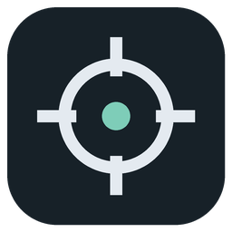
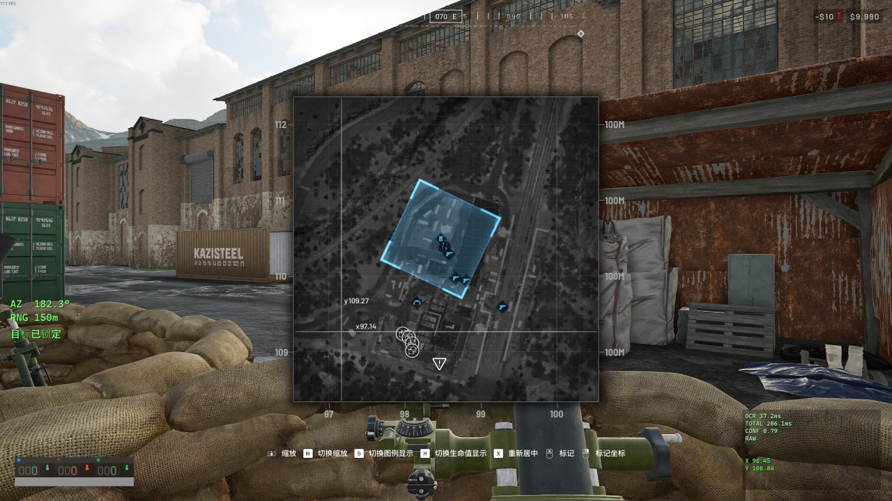
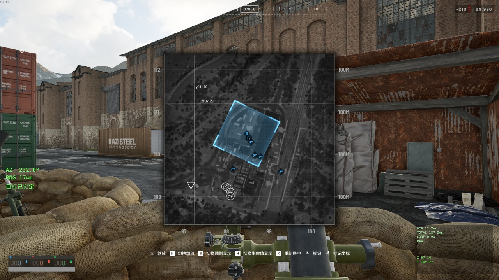
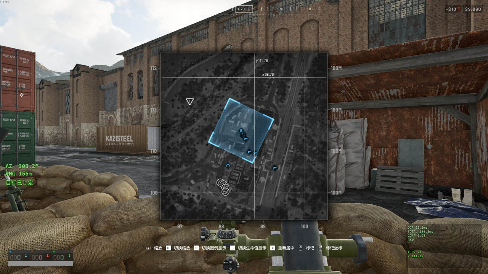
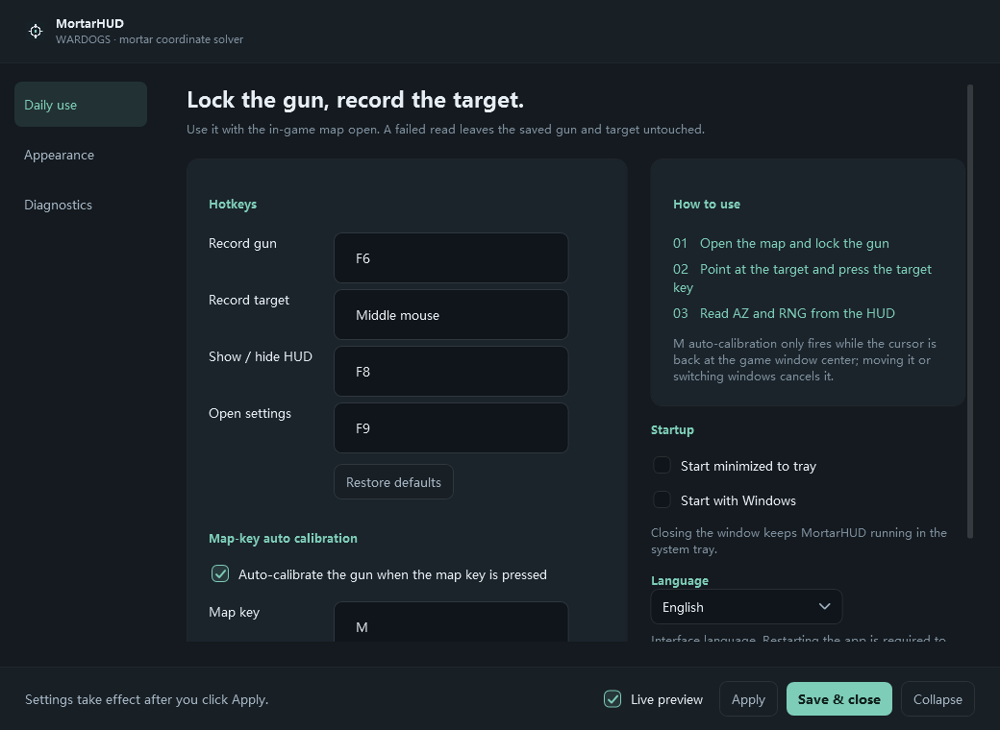

<div align="center">



# MortarHUD

**An external HUD that solves mortar coordinates for *Wardogs***

[](https://github.com/Cec1c/MortarHUD/actions/workflows/ci.yml)
[](https://dotnet.microsoft.com/)
[](#project-layout)
[](https://github.com/shimat/opencvsharp)
[](https://github.com/tesseract-ocr/tesseract)
[](#testing)
[](#requirements)

Reads the coordinate readout off the in-game map, solves the bearing and range to your target, and shows them in a click-through always-on-top overlay.

**English** ｜ [中文](README.zh-CN.md)

[Quick start](#quick-start) ｜ [In game](#in-game) ｜ [UI](#ui) ｜ [OCR](#ocr) ｜ [Project layout](#project-layout) ｜ [Known limits](#known-limits)

</div>

## What it does

Open the map in *Wardogs* and point at any spot — the game shows the absolute coordinates of that point next to your cursor. MortarHUD reads those two lines and works out the bearing and range from your mortar to the target.

```text
input (game screen)     output (HUD)
y109.78                 AZ  079.0°
x98.09                  RNG 152m
```

Because it reads *absolute* coordinates, zooming, panning and re-centering the map make no difference. Once the gun position is locked it stays valid even after your own map marker disappears — which happens as soon as you get on a mortar.

### Safety boundaries

- No process injection, no reading or writing game memory
- No simulated keyboard or mouse input
- No network access; OCR runs entirely locally
- Runs as a normal user, no administrator rights

It does exactly two things: register global hotkeys, and grab a small region of the screen at the moment you press one. No auto-aim, no ballistics simulation, no wind correction, no enemy detection — the output is two numbers, bearing and range.

## In game

Four captures on the same map, the cursor moved to a different spot each time:

| | |
| --- | --- |
|  |  |
|  |  |

Bearing and range come out as 182.3° / 150 m, 232.0° / 174 m, 303.2° / 155 m and 009.8° / 146 m. The `y` / `x` lines beside the map cursor are what the OCR reads; the green block on the left is the HUD, and the panel in the bottom-right corner is the optional diagnostics readout.

## UI



Three pages: Daily use / Appearance / Diagnostics. Hotkeys, HUD size and position are expanded by default; font effects and engine paths are tucked into collapsible sections.

The interface ships in Chinese and English. On first launch it picks one from your system language (Chinese systems get Chinese, everything else gets English); you can change it later under **Daily use → Language**, and it takes effect after a restart.

## Quick start

Requires the **.NET 10 SDK**. **Windows x64 only.**

```bash
dotnet build MortarHUD.sln -c Release
dotnet test MortarHUD.sln
publish.cmd                     # self-contained; end users need no runtime
```

Or grab the portable build from [Releases](https://github.com/Cec1c/MortarHUD/releases) and just double-click `MortarHUD.exe`.

First run:

```text
1. Start the app; closing the settings window leaves it in the system tray
2. Open the in-game map, move the cursor onto your mortar, press F6
3. Move the cursor onto the target, press the middle mouse button
4. Repeat step 3 for each new target
```

| Hotkey | Action |
| --- | --- |
| `F6` | Record gun position |
| `Middle mouse` | Record target |
| `F8` | Show / hide HUD |
| `F9` | Open settings |

All of them are rebindable. Target capture defaults to the middle mouse button rather than F7 because the function-key row tends to clash with the game's own bindings.

When a read fails the HUD says why and keeps the previous target — it never carries on with a coordinate that might be wrong. A capture that never happens is reported too ("Map not open", "Cursor moved, cancelled") instead of silently doing nothing.

### Auto-calibration with the map key

Pressing **M** in game opens the map and the cursor is re-centered on your own position, so pressing M is equivalent to putting the cursor on the mortar.

This uses an observing listener (Raw Input) rather than `RegisterHotKey` — the latter would swallow the M key, the game would never see it and the map would not open. After the key is pressed MortarHUD waits 350 ms, then only accepts the result if the cursor really is back at the center of the foreground window; otherwise it skips and says so on the HUD. Moving the mouse, switching windows or closing the map cancels a pending calibration.

> [!TIP]
> The first time you use it, open **Diagnostics → Inspect a single recognition** and click the test button. It shows the captured image, the preprocessed result and the raw text from every pipeline, which immediately tells you whether the ROI is framing the coordinates.

## Coordinate system and solving

```text
+X = East            +Y = North
1 coordinate unit ≈ 100 m
Bearing: North = 0°, East = 90°, South = 180°, West = 270°

dx = Xtarget − Xgun
dy = Ytarget − Ygun

RNG = √(dx² + dy²) × metersPerUnit
AZ  = atan2(dx, dy) in degrees, normalized to [0, 360)
```

Note the argument order of `atan2` is **(east, north)**, the opposite of the usual `(y, x)`; unit tests covering all eight directions pin this down. Everything here is configurable.

## OCR

It reads the two coordinate lines near the cursor **twice**: the same binarized image, read once with each of two Tesseract page segmentation modes (single block / sparse text). If the two readings disagree the whole capture fails — no voting, and no quietly picking whichever one looks better.

```bash
dotnet run --project tools/MortarHUD.Benchmark     # writes docs/ocr-benchmark.md
```

Current baseline (3 real screenshots):

| Configuration | Accuracy | Average time |
| --- | --- | --- |
| **Auto (production default)** | **3/3** | ~163 ms |
| Tesseract + pipeline C | 3/3 | ~55 ms |

Each segmentation mode has its own characteristic mistake and they do not overlap: mode 6 occasionally misreads the last digit (99.75 against a true 99.73), mode 11 occasionally drops leading digits (0.07 against a true 110.07). Together they check each other, and a sample that defeats one is still read correctly.

The default ROI is `offset(5, −74)`, `100×96` — the text block measured from real "full screen + cursor position" sampling, plus 12 px of margin. It scales with screen height relative to 1080p.

| Setting | Default |
| --- | --- |
| Engine / preprocessing | Auto (Tesseract + pipeline C, cross-checked across two segmentation modes) |
| Coordinate range | 0 – 200 |
| Minimum confidence | 0.60 |
| Require a decimal point | on |

Confidence is *not* the engine's own number — measured against real captures, Tesseract reports 0.00 for coordinates it read **correctly**. MortarHUD computes a combined score:

```text
0.55  (format and range validation passed)
+ 0.25 × (agreeing readings / total readings)
+ 0.20 × (engine's own confidence)
```

That is compared against the threshold only *after* aggregation, so one reading reporting 0.00 cannot veto the result on its own. Conversely, raising the threshold to 0.9 will reject everything, because 0.55 + 0.25 = 0.80 is the ceiling for two agreeing readings.

Turning "require a decimal point" off lets `98` count as a valid reading of `98.09` — an 81-metre error. Leave it on.

### Template engine

A fallback for when the language data is missing. Its glyph library is learned from real screenshots and covers `x y . 0 1 2 3 4 5 6 7 8 9`. Unknown glyphs are reported as `?` rather than guessed, and the parser then fails the capture — never a silent wrong coordinate.

Regenerate it from the built-in baseline screenshots:

```bash
dotnet run --project tools/MortarHUD.Benchmark -- --gen-templates
```

The baseline set is only three screenshots, and its coordinates happen not to contain a `2` or a `3`. So the library is instead generated from the captures in `%AppData%\MortarHUD\Debug\` (Settings → enable capture), which carry their own labels: each record stores the coordinate that was read, so the text on screen is known and the glyphs can be labelled automatically — no manual bounding boxes.

```bash
dotnet run --project tools/MortarHUD.Benchmark -- --gen-from-debug
```

Add `--debug-dir <path>` to read captures from somewhere else. Only captures whose coordinate was read successfully are used. The captures themselves are not committed — regenerate the library from your own, and the coverage test below will tell you if anything is missing.

## Configuration

```text
%AppData%\MortarHUD\
├─ settings.json      # main settings (with schemaVersion)
├─ Themes\            # custom HUD themes, one JSON per theme
├─ Logs\              # one file per day, pruned after 14 days
└─ Debug\             # dumped ROIs and results (off by default)
```

The HUD can be adjusted in layout (Minimal / Compact / Detailed / Horizontal), font family, size and weight, letter and line spacing, seven colours, outline, shadow and background panel, opacity, anchor and offset, which fields to show, and decimal places. Position is either an anchor plus offset, or tick "unlock HUD position" and drag it directly.

Four built-in themes: Default Green, Tactical White, Amber, High Contrast. Built-in themes cannot be edited or deleted — use "Save as" to fork one into a custom theme, and themes can be imported and exported.

## Project layout

```text
src/
├─ MortarHUD.Localization/       # UI strings (zh / en), no dependencies
│
├─ MortarHUD.Core/               # pure logic, no Windows or UI dependency
│  ├─ Models/ Ballistics/ Parsing/ Validation/
│  ├─ Session/                   # state machine, HUD layout, operation scheduling
│  ├─ Configuration/ Themes/     # settings and themes
│  └─ Diagnostics/               # file logging
│
├─ MortarHUD.Capture/            # capture → preprocess → OCR
│  ├─ ScreenCapture/             # GDI capture + ROI maths
│  ├─ ImageProcessing/           # pipelines A / B / C
│  └─ Ocr/                       # engine interface, Tesseract, template matching, cross-validation
│
├─ MortarHUD.Platform.Windows/   # Win32 interop
│  ├─ Hotkeys/                   # Raw Input listeners
│  ├─ Mouse/ WindowStyles/ Dpi/ Startup/
│
└─ MortarHUD.App/                # WPF
   ├─ Views/ ViewModels/ Services/ Tray/
   ├─ Localization/              # XAML markup extension for the string table
   ├─ Assets/                    # application icon
   └─ Models/                    # OCR resources shipped with the app

tests/                           # Core.Tests / Ocr.Tests / Fixtures
tools/MortarHUD.Benchmark/       # benchmark + glyph template generation
```

The layers are decoupled: `Capture ≠ OCR ≠ Parser ≠ Calculator ≠ Overlay`, and each can be replaced and tested on its own. OCR engines sit behind `ICoordinateOcrEngine`, preprocessing behind `IImagePreprocessor`.

## Testing

```bash
dotnet test MortarHUD.sln       # 244 tests (218 Core + 26 OCR)
```

Coverage includes all eight solving directions and the `[0, 360)` boundary, the formats the parser must accept and must reject, state-machine semantics (no solving without a gun position, a failed OCR never corrupts the target), ROI scaling and negative multi-monitor origins, end-to-end OCR on three real screenshots, preprocessing polarity, and settings/theme round-trips.

The self-test walks the full startup path (constructs every window and runs one real recognition) without showing windows, registering hotkeys or capturing the screen:

```bash
dist\MortarHUD\MortarHUD.exe --selftest        # exit code 0 means it passed
```

A wrong recognition counts as a failure and returns non-zero, so you can't get a green self-test on a broken OCR path.

## Distribution

| Mode | Command | Size | Runtime needed on target |
| --- | --- | --- | --- |
| **Single-file portable** (default) | `publish.cmd` | ~95 MB | nothing |
| Self-contained folder | `publish.cmd folder` | ~227 MB | nothing |
| Framework-dependent | `publish.cmd runtime` | ~60 MB | .NET 10 desktop runtime |

Output goes to `dist\MortarHUD-next-<mode>\`; a non-empty directory is refused so old and new DLLs never get mixed. The portable build is a **genuine single file** — `Models\` (OCR language data and glyph library) is packed inside too and extracted to `%TEMP%\.net\` at runtime. Most of the size is the .NET runtime and `OpenCvSharpExtern.dll` (59 MB); the project's own four DLLs add up to under 0.5 MB. Getting down to 95 MB takes single-file compression plus dropping OpenCV's FFmpeg plugin and Tesseract's x86 libraries.

> [!NOTE]
> Single-file mode has to extract the native libraries to `%TEMP%\.net\` before loading them, so it starts a little slower than folder mode — and a smaller download does not mean less disk usage. Use `folder` if startup time matters.

## Known limits

Things that need a human and cannot be automated:

- Whether the overlay is genuinely always-on-top, click-through, and does not steal focus — plus Alt+Tab behaviour
- Position and ROI at 100% / 125% / 150% / 200% DPI
- Multiple monitors
- Windowed / borderless windowed / exclusive fullscreen
- Whether the hotkeys clash with the game's own bindings

> [!IMPORTANT]
> In exclusive fullscreen the HUD may be invisible or screen capture may fail. That is an inherent limitation of an external tool and will not be worked around by injecting into the process. **Borderless windowed mode is recommended.**

Also: the template engine is missing digits 2 and 3 (it is only reached when the language data is unavailable), there is no installer, and the default ROI was measured at 1080p — if your game UI scale differs a lot, adjust it once via **Diagnostics → Inspect a single recognition**.

## Development

Adding a preprocessing pipeline: implement `IImagePreprocessor`, return a single-channel "black text on white" `Mat`, and register it in `PreprocessorFactory.All`. Only consider adding it to `AutoCandidates` once the benchmark likes it — every extra pipeline costs `Auto` about 40 ms and the end-to-end target is under 100 ms.

Adding an OCR engine: implement `ICoordinateOcrEngine`. An engine only fills in `RawText` and `Confidence`; leave `X`/`Y` empty and let `CoordinateTextParser` do the numeric parsing.

Debugging OCR — seeing the preprocessed image is the only reliable method:

```bash
dotnet run --project tools/MortarHUD.Benchmark -- --dump ./_analysis/processed
```

This writes the binarized output of every pipeline on every fixture as a PNG. Look at the image first, then at the recognition result — never the other way round.

The same facilities are in the app under **Diagnostics**: "Inspect a single recognition" shows the raw image, the preprocessed images, and each pipeline's text and timing; "Collect the next 10 captures" dumps raw ROIs, preprocessed images and result JSON, then stops automatically — that is the tool for intermittent failures.

Logs live in `%AppData%\MortarHUD\Logs\yyyy-MM-dd.log` and record startup, shutdown, hotkeys, captures, raw OCR output, validation failures and exceptions.

> [!NOTE]
> Picking up development? Read **[AGENTS.md](AGENTS.md)** first — environment gotchas, architecture, and the traps already stepped on are all in there.

## Community

QQ group (Chinese) **2166037429** — questions, screenshots of failed reads, feature requests.

When reporting a recognition problem, include the logs from `%AppData%\MortarHUD\Logs\` and the files produced by **Diagnostics -> Collect the next 10 captures**; it saves a lot of back and forth.

---

## License

[Apache-2.0](LICENSE) © 2026 Cec1c

It only reads screen pixels. Using it means accepting all consequences, including but not limited to any risk under the game's terms of service.
