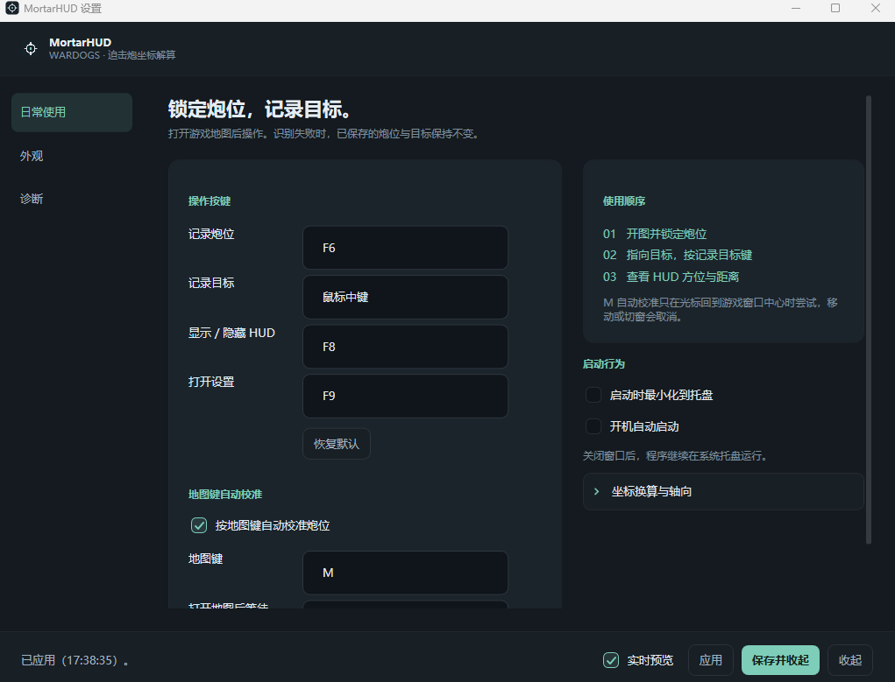

<div align="center">


# MortarHUD

**《Wardogs》迫击炮坐标解算外置 HUD**

[](https://dotnet.microsoft.com/)
[](#项目结构)
[](https://github.com/shimat/opencvsharp)
[](https://github.com/tesseract-ocr/tesseract)
[](#测试)
[](#环境要求)

读屏识别游戏地图上的坐标读数，实时解算迫击炮的方位角与距离，透明置顶显示。

[快速开始](#快速开始) ｜ [界面](#界面) ｜ [OCR](#ocr) ｜ [项目结构](#项目结构) ｜ [已知边界](#已知边界)

</div>

## 它做什么

《Wardogs》打开地图后，鼠标指向任意位置，游戏会在光标旁显示该点的绝对坐标。MortarHUD 读出这两行，算出炮位到目标的方位角与距离。

```text
输入（游戏画面）        输出（HUD）
y109.78                AZ  079.0°
x98.09                 RNG 152m
```

读的是绝对坐标，所以地图缩放、平移、重新居中都不影响结果。炮位锁定后即使自己的地图箭头消失（进入迫击炮后常见），已保存的炮位依然有效。

### 安全边界

- 不注入进程，不读写游戏内存
- 不模拟任何键鼠输入
- 不联网，OCR 全在本地跑
- 普通用户权限运行，不需要管理员

只做两件事：注册全局热键，按键那一刻截取屏幕上一小块。不实现自动瞄准、弹道模拟、风偏修正、敌人识别——输出只有方位角和距离两个数。

## 界面



三页：日常使用 / 外观 / 诊断。键位、HUD 大小与位置默认展开，字体特效、引擎路径这类收在折叠项里。

## 快速开始

需要 **.NET 10 SDK**，仅支持 **Windows x64**。

```bash
dotnet build MortarHUD.sln -c Release
dotnet test MortarHUD.sln
publish.cmd                     # 自包含发布，用户端不需要装 .NET
```

也可以直接下 [Release](https://github.com/Cec1c/MortarHUD/releases) 里的便携版，解压双击 `MortarHUD.exe`。

首次使用：

```text
1. 启动程序，关掉设置窗口后它留在系统托盘
2. 打开游戏地图，鼠标移到炮位，按 F6
3. 鼠标移到目标，按鼠标中键
4. 换目标重复第 3 步
```

| 热键 | 作用 |
| --- | --- |
| `F6` | 记录炮位 |
| `鼠标中键` | 记录目标 |
| `F8` | 显示 / 隐藏 HUD |
| `F9` | 打开设置 |

全部可在设置里改。记录目标默认用中键而非 F7，是因为 F 键区常和游戏本身的功能打架。

识别失败时 HUD 显示 `OCR FAILED` 并保留上一个目标，不会拿一个可能是错的坐标继续用。

### 按 M 自动校准

游戏里按 **M** 开地图时鼠标会复位到屏幕中心，也就是自己所在的位置，所以按 M 等价于把光标移到炮位上。

走的是观察型监听（Raw Input），只监听不拦截——`RegisterHotKey` 会截住 M，游戏就收不到、地图打不开。按下后等 350ms 再读，且只有光标确实回到前台窗口中心才采用结果，没归位就跳过并记日志。移动鼠标、切窗、关图都会取消挂起的校准。

> [!TIP]
> 第一次用建议先开**诊断 → 查看单次识别结果**，点一次「对当前光标位置测试一次」。它会显示实际截到的图、预处理结果和每条流水线的原始文本，能立刻看出 ROI 有没有框住坐标。

## 坐标系与解算

```text
+X = 东（East）      +Y = 北（North）
1 坐标单位 ≈ 100 米
方位角：北 = 0°，东 = 90°，南 = 180°，西 = 270°

dx = X目标 − X炮位
dy = Y目标 − Y炮位

RNG = √(dx² + dy²) × 每单位米数
AZ  = atan2(dx, dy) 转角度，归一到 [0, 360)
```

`atan2` 的参数顺序是 **(东分量, 北分量)**，和常见的 `(y, x)` 相反，有覆盖八个方向的单元测试钉住。全部可配置。

## OCR

三条图像流水线各自二值化、各自识别，结果互相矛盾就整体判失败，不投票也不挑一个用。

```bash
dotnet run --project tools/MortarHUD.Benchmark     # 生成 docs/ocr-benchmark.md
```

当前基准（3 张实机截图）：

| 配置 | 正确率 | 平均耗时 |
| --- | --- | --- |
| **Auto（生产默认）** | **3/3** | ~109 ms |
| Tesseract + 全部流水线 | 3/3 | ~99 ms |
| 任意单条流水线（A / B / C） | 2/3 | 36–89 ms |

单条流水线都会错一例，且错的不是同一例——交叉验证后 3/3，这是整个设计的立足点。

ROI 默认值 `offset(−15, −90)`、`150×140` 是拿三张 1920×1080 截图实测反推的：y 行左上角约在光标 `+(21, −57)`，x 行再 `+(25, +55)`，整块读数约 70×67 px。不同分辨率按屏幕高度相对 1080 自动缩放。

| 设置项 | 默认值 |
| --- | --- |
| 引擎 / 预处理 | Auto（Tesseract + 流水线 A、C 交叉验证） |
| 坐标范围 | 0 – 200 |
| 最低置信度 | 0.60 |
| 必须识别出小数点 | 开 |

置信度不是引擎自报的值——实测 Tesseract 对**读对**的坐标也会给 0.00。程序用的是综合置信度：

```text
0.55（格式与范围校验通过）
+ 0.25 ×（一致流水线数 / 总流水线数）
+ 0.20 ×（引擎自报置信度）
```

在**汇总之后**才和门槛比较，所以某条流水线自报 0.00 不会一票否决。反过来调到 0.9 时，即便两条一致也会被拦掉（0.55 + 0.25 = 0.80 封顶）。

关掉「必须识别出小数点」后，`98.09` 读成 `98` 也算合法坐标——那是 81 米误差，别关。

> [!WARNING]
> 基准集只有 **3 个 ROI**，目标至少是 **30 个**（覆盖不同地图区域、明暗背景、缩放等级）。凑齐前不应认为 OCR 已经稳定（目标正确率 ≥ 99%）。补图方式见 `tests/Fixtures/fixtures.json` 的结构。

### 模板引擎

语言包缺失时的兜底，字形库从实机截图里自动学出来：

```bash
dotnet run --project tools/MortarHUD.Benchmark -- --gen-templates
```

当前覆盖 `x y . 0 1 4 5 6 7 8 9`，**缺数字 2 和 3**（三张截图里没出现过）。遇到不认识的字形输出 `?` 而不是猜值，解析器随即判失败。Tesseract 覆盖全部十个数字，所以生产默认走它。

## 配置

```text
%AppData%\MortarHUD\
├─ settings.json      # 主设置（带 schemaVersion）
├─ Themes\            # 自定义 HUD 主题，每个主题一个 JSON
├─ Logs\              # 按天分文件，自动清理 14 天前
└─ Debug\             # 转储的 ROI 与识别结果（默认关闭）
```

HUD 可改布局（Minimal / Compact / Detailed / Horizontal）、字体字号字重、字间距行距、七个颜色项、描边阴影背景板、不透明度、锚点与偏移、显示字段、小数位。位置支持填锚点+偏移，或勾选「解锁 HUD 位置」后直接拖。

内置四套主题：Default Green、Tactical White、Amber、High Contrast。内置主题不能删改，可以「另存为」出自定义主题再改，支持导入导出。

## 项目结构

```text
src/
├─ MortarHUD.Core/               # 纯计算，无 Windows / UI 依赖
│  ├─ Models/ Ballistics/ Parsing/ Validation/
│  ├─ Session/                   # 状态机、HUD 排版、操作调度
│  ├─ Configuration/ Themes/     # 设置与主题
│  └─ Diagnostics/               # 文件日志
│
├─ MortarHUD.Capture/            # 截屏 → 预处理 → OCR
│  ├─ ScreenCapture/             # GDI 截屏 + ROI 计算
│  ├─ ImageProcessing/           # Pipeline A / B / C
│  └─ Ocr/                       # 引擎接口、Tesseract、模板匹配、交叉验证
│
├─ MortarHUD.Platform.Windows/   # Win32 互操作
│  ├─ Hotkeys/                   # Raw Input 监听
│  ├─ Mouse/ WindowStyles/ Dpi/ Startup/
│
└─ MortarHUD.App/                # WPF
   ├─ Views/ ViewModels/ Services/ Tray/
   ├─ Assets/                    # 应用图标
   └─ Models/                    # 随程序发布的 OCR 资源

tests/                           # Core.Tests / Ocr.Tests / Fixtures
tools/MortarHUD.Benchmark/       # 基准测试 + 字形模板生成
```

各层解耦：`Capture ≠ OCR ≠ Parser ≠ Calculator ≠ Overlay`，每层可单独替换和测试。OCR 引擎藏在 `ICoordinateOcrEngine` 后面，预处理藏在 `IImagePreprocessor` 后面。

## 测试

```bash
dotnet test MortarHUD.sln       # 214 个（188 Core + 26 OCR）
```

覆盖解算八方向与 `[0, 360)` 边界、解析的合法与必须拒绝格式、状态机语义（无炮位拒绝计算、OCR 失败不污染目标）、ROI 缩放与多显示器负原点、三张真实截图的端到端 OCR、预处理极性、设置与主题的读写往返。

启动自检走完整启动流程（构造全部窗口 + 跑一次真实识别），但不显示窗口、不注册热键、不截屏：

```bash
dist\MortarHUD\MortarHUD.exe --selftest        # 退出码 0 表示通过
```

识别结果不对会算作失败并返回非 0，不会出现「识别挂了但自检仍然绿」。

## 分发

| 方式 | 命令 | 体积 | 目标机器需要 |
| --- | --- | --- | --- |
| **单文件便携版**（默认） | `publish.cmd` | ~95 MB | 什么都不用装 |
| 自包含文件夹 | `publish.cmd folder` | ~227 MB | 什么都不用装 |
| 框架依赖 | `publish.cmd runtime` | ~60 MB | .NET 10 桌面运行时 |

输出到 `dist\MortarHUD-next-<模式>\`，目录非空时拒绝发布（避免新旧 DLL 混在一起）。便携版是**真正的单文件**——`Models\`（OCR 语言包与字形库）也一并打包，运行时释放到 `%TEMP%\.net\`。体积大头是 .NET 运行时和 `OpenCvSharpExtern.dll`（59 MB）；项目自身三个 DLL 加起来 0.25 MB。压到 95 MB 靠的是单文件压缩、剔掉 OpenCV 的 FFmpeg 插件和 Tesseract 的 x86 库。

> [!NOTE]
> 单文件模式启动时要把原生库解压到 `%TEMP%\.net\` 再加载，比文件夹模式慢一点，分发体积的下降也不等于磁盘占用下降。在意启动速度就用 `folder`。

## 已知边界

需要真人操作、自动化不了的：

- Overlay 是否真置顶、真鼠标穿透、不抢焦点、Alt+Tab 行为
- 100% / 125% / 150% / 200% DPI 下的位置与 ROI
- 多显示器
- 窗口化 / 无边框窗口 / 独占全屏三种模式
- 热键与游戏本身是否冲突

> [!IMPORTANT]
> 独占全屏下 HUD 可能不可见或截图失败，这是外置工具的固有限制，不会通过注入进程绕过。**推荐无边框窗口模式**。

其它：基准集只有 3 个 ROI；模板引擎缺数字 2、3；没有安装包；ROI 默认值按 1080p 实测，游戏 UI 缩放差得多的话需要用「诊断 → 查看单次识别结果」调一次。

## 开发

加预处理流水线：实现 `IImagePreprocessor`，返回黑字白底的单通道 `Mat`，在 `PreprocessorFactory.All` 注册。基准表现够好再考虑加进 `AutoCandidates`——每多一条流水线 `Auto` 就多约 40ms，而端到端目标是 100ms 以内。

加 OCR 引擎：实现 `ICoordinateOcrEngine`。引擎只管把字读出来填 `RawText` 与 `Confidence`，`X`/`Y` 一律留空，数值解析交给 `CoordinateTextParser`。

调试 OCR——预处理结果肉眼可见，这是唯一靠谱的手段：

```bash
dotnet run --project tools/MortarHUD.Benchmark -- --dump ./_analysis/processed
```

把每条流水线在每张 fixture 上的二值化结果写成 PNG。先看图，再看识别结果，不要反过来。

程序内对应功能在**诊断**页：「查看单次识别结果」显示原图、预处理图、每条流水线的文本与耗时；「收集接下来 10 次采集」把原始 ROI、各流水线预处理图和结果 JSON 一并落盘后自动停止，排查间歇性失败用这个。

日志在 `%AppData%\MortarHUD\Logs\yyyy-MM-dd.log`，记录启动、退出、热键、采集、OCR 原始输出、校验失败与异常。

> [!NOTE]
> 要接手继续开发先读 **[AGENTS.md](AGENTS.md)** —— 环境坑、架构、踩过的雷都在里面。

---

## 协议

[Apache-2.0](LICENSE) © 2026 Cec1c

只读取屏幕像素。使用它意味着你接受由此带来的一切后果，包括但不限于游戏服务条款方面的风险。
