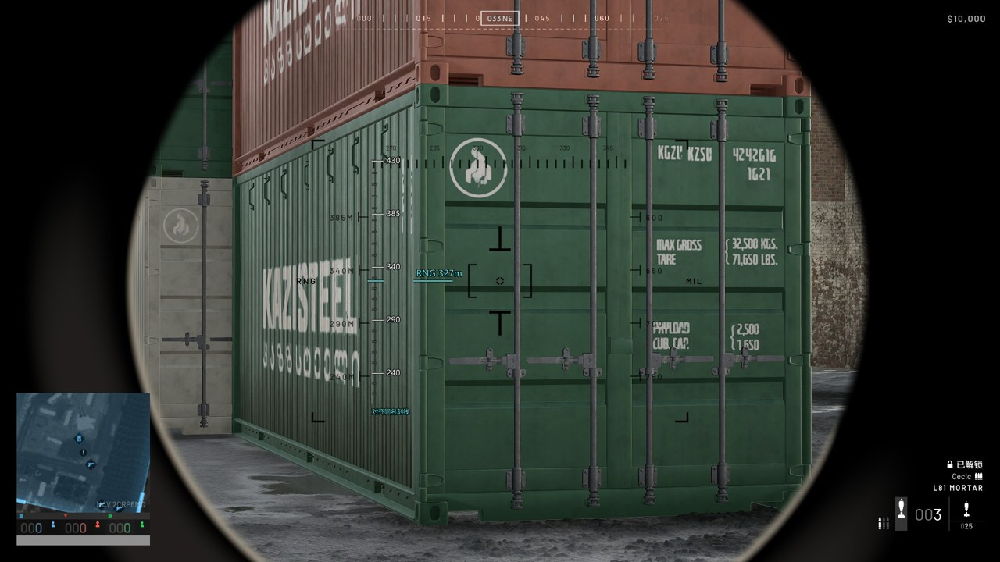

# M 键与炮口标尺验收

新程序：`dist/MortarHUD-20260922-M-ruler-portable/MortarHUD.exe`。

便携版 EXE 95.42 MiB，无需另装 .NET。发布产物已从 `C:/Users/15185` 工作目录完成自检与离屏渲染，退出码均为 0；日志确认 `Tesseract+Tesseract / C+C-Balanced`，不是模板引擎回退。

EXE SHA-256：`5270D5BB9E0866633A5D9E19ACA05B49BFB3C080A82AC09325EBF095883A8ADF`。

## 使用

1. 从托盘退出旧版，再启动上面的新程序。
2. 按 M 开图后让光标短暂停留约 0.4 秒，确认「炮位已锁定」。默认等待改为 150ms，已有自定义的 200ms 保留。再按 M 关图、立即切窗、点击或滚轮，不得把之后的画面写入炮位。
3. 用中键记录目标，打开设置 → **炮口标尺** → 勾选 **启用炮口标尺** → 应用。
4. 进入迫击炮瞄准视图，调整炮口，让游戏的距离刻线与外置标尺的同名刻线重合。青色线保持在准星中心，文字跟随当前计算的 RNG。
5. **F10** 单独收起/显示标尺；**F8** 同时控制 HUD 与标尺。预览框里的 327m 只用于演示，不会修改游戏中的目标。

例如目标 RNG=327m：外置 `340` 刻线位于 1080p 的 **Y=513.48px**。把游戏里的 `340M` 刻线移到这个高度，即达到刻度表插值得到的 327m 设置。无需在游戏的两条粗刻线之间凭感觉估计。



上图将实际程序渲染叠到用户原截图上，用来说明位置；原截图的炮口没有重新调整到 327m，不能作为实机命中验证。

## 分辨率校准

基于提供的 6 张 1920×1080 L81 MORTAR 截图：

- 准星中心高度：540px。
- 每 50 MIL 竖直间距：约 102px。
- 外置标尺横坐标：714px，放在游戏原刻线右侧。
- 可用距离：80–684m。范围外只提示，不生成误导性的瞄准刻线。

在标尺页添加例如 `2560x1440` 后，修改该分辨率的横坐标、中心高度、50 MIL 间距，再点应用。运行时按**游戏客户区的实际像素尺寸**自动选择配置，并跟随窗口位置；没有保存配置时按画面高度缩放，显示「分辨率初值」提示。Windows DPI 不作为射击刻度比例。FOV、武器或瞄准缩放改变后需要重新标定。

| RNG（m） | MIL | RNG（m） | MIL |
| --- | --- | --- | --- |
| 80 | 950 | 430 | 550 |
| 110 | 900 | 470 | 500 |
| 132 | 850 | 510 | 450 |
| 187 | 800 | 545 | 400 |
| 240 | 750 | 578 | 350 |
| 290 | 700 | 609 | 300 |
| 340 | 650 | 637 | 250 |
| 385 | 600 | 661 | 200 |
| — | — | 684 | 150 |

各标注点之间采用分段线性插值，不宣称游戏弹道或实际落点已验证。

## M 修正依据

旧采集先截整屏并编码 PNG，再另截 OCR 小图。Samples 中有清晰坐标，实际 OCR 却可能已经截到稍后出现的炮位说明浮层。旧重试又等待上一轮 OCR 完成，使后续截图更晚。

现在一轮 M 按配置等待后，每隔 60ms 冻结一帧（默认 4 帧），再识别已有画面；相邻两张截图坐标一致才锁定。只在光标回中、前台未变化时截图，过期时间点不补拍。连拍完成后允许移动光标；点击、滚轮、键盘、新采集或切窗仍取消。失败保留原炮位和目标。

诊断整屏与 OCR 小图来自同一张画面，PNG 编码走容量 2 的后台队列；队列满时丢诊断副本，不阻塞正常识别。

白色坐标与青蓝地图边框的颜色不同。新 C 使用通道最小值抑制彩色背景，另用保留一半灰度的 C-Balanced 保护细笔画；两者各跑 PSM 6/11。**全部有效读数必须一致，不投票，不降低格式或置信度要求。**

## 验证记录

- Release 构建成功，测试 **277/277**：243 Core + 34 OCR。
- 新增 **54 张真实 ROI** 回归：32 张清晰坐标正确识别、18 张遮挡/无坐标画面拒绝、4 张较早歧义样本正确读取或拒绝。
- 离线回放：9 月 22 日 132 帧，通过数 **22 → 42**；9 月 17 日 149 帧，通过数 **98 → 116**。合计 **120 → 158 / 281**。
- 9 月 22 日原先通过的 22 帧均保留；新增 20 帧均对应原图 `98.49 / 110.38`。
- 较早样本有 3 帧从通过变为拒绝，其中一帧旧读数 `97.98` 与原图 `97.93` 不符。其余两帧属于保守性回退，保留在回归集中，不以多数票强行接受。
- 上述“通过数”含关图、遮挡、过渡画面，**不是准确率，也不是 M 实机成功率**。
- 设置四页、标尺页滚动底部，以及 1080p/1440p/4K 标尺使用程序本身离屏渲染检查。
- 自检退出不再保存临时默认设置；检查 `%AppData%/MortarHUD/settings.json` 的 SHA-256 确认验收工具未改变用户配置。

## 明早实机检查

1. 连续开关地图 10 次：开图及时锁炮位，关图不改原炮位；中键目标流程正常。
2. M 后快速移动、点击、再次按 M、Alt+Tab：不得采用迟到读数；日志 `[M]` 记录每帧冻结时间和识别结果。
3. 在炮口视图检查 290/340/385m 刻线能同时对齐；尝试 327m 等中间值。
4. 改分辨率后确认自动匹配配置；改变间距和中心高度保存、重启，确认各分辨率互不覆盖。
5. 检查 F10、F8、鼠标穿透、游戏不失焦；独占全屏、多屏、高 DPI 和实际落点仍需实机验收。

## 复现命令

```powershell
& 'C:/dotnet10/dotnet.exe' test MortarHUD.sln -c Release
& 'C:/dotnet10/dotnet.exe' run --project tools/MortarHUD.Benchmark -c Release -- --replay-samples "$env:APPDATA\MortarHUD\Samples" '_analysis/replay.json' '2026-09-22'
# 增加 --legacy-gray 可对照旧的 C 处理。
& './dist/MortarHUD-20260922-M-ruler-portable/MortarHUD.exe' --selftest
& './dist/MortarHUD-20260922-M-ruler-portable/MortarHUD.exe' --screenshot '_analysis/acceptance' --expanded --compact
```

源码、文档和回归样本纳入版本控制；便携版产物位于上述本地 `dist` 目录。原始截图、原发布目录与用户设置文件保留。
