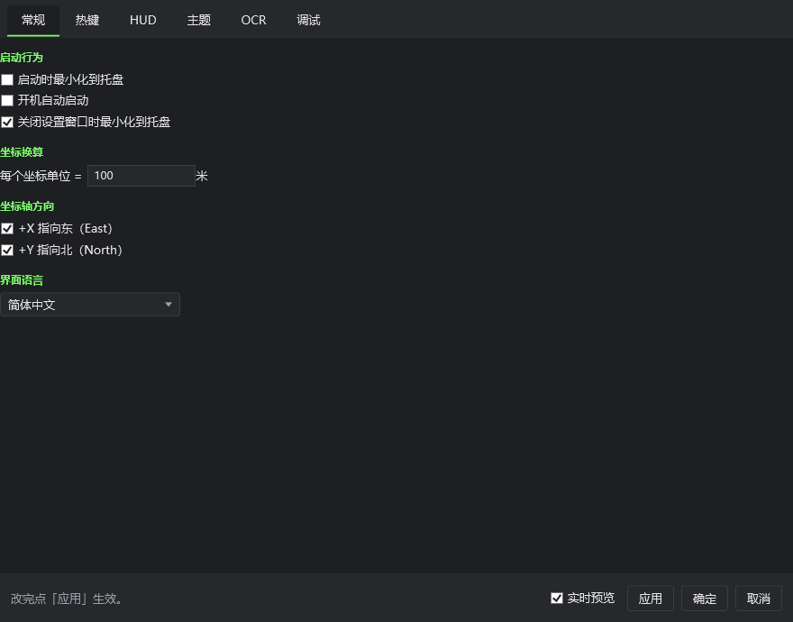
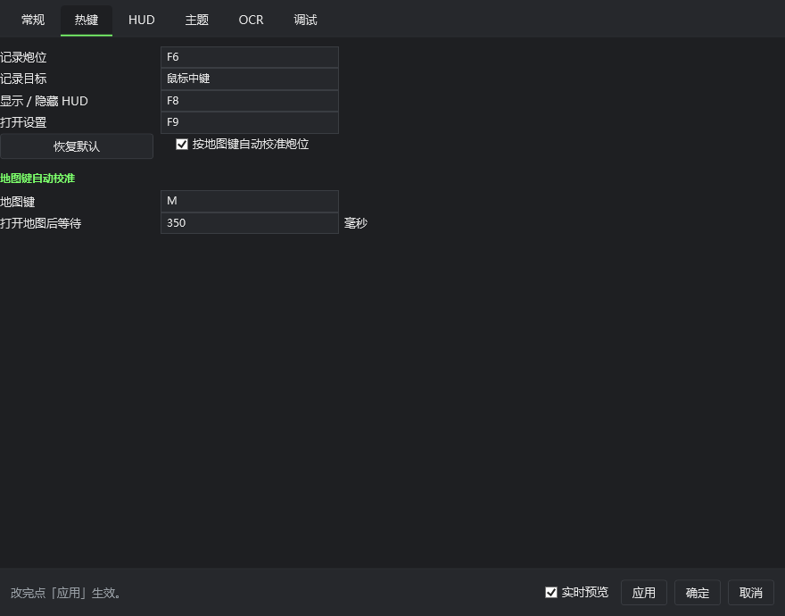
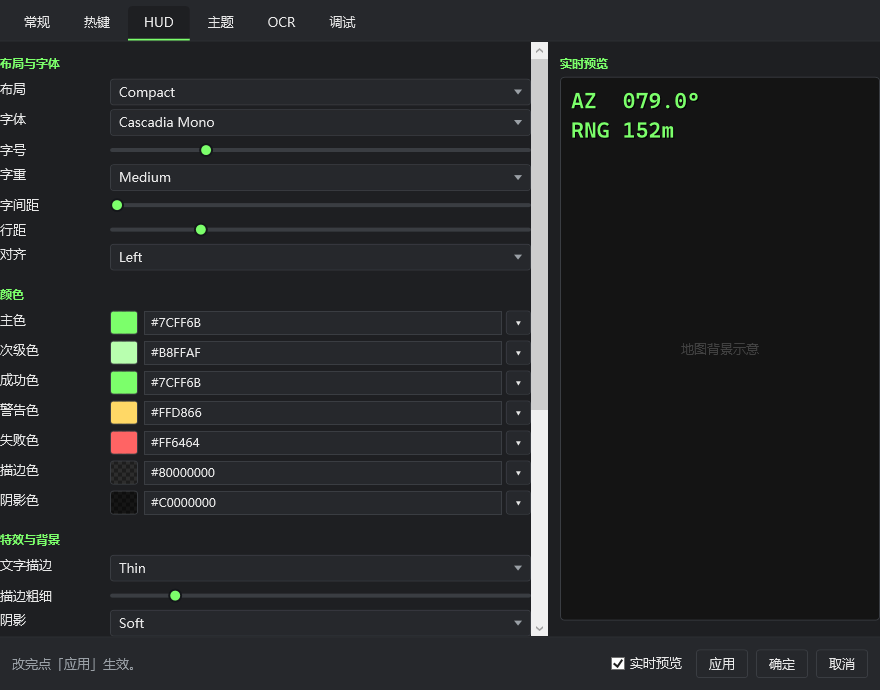
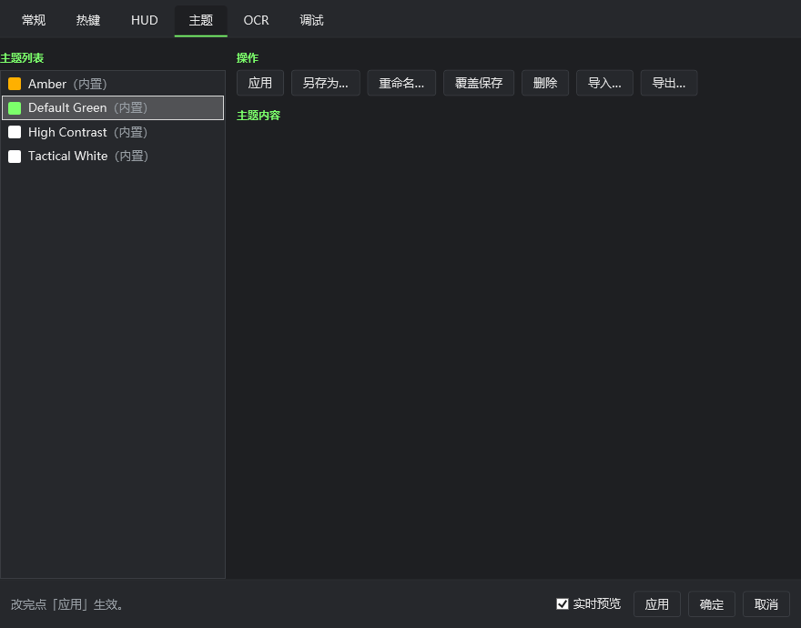
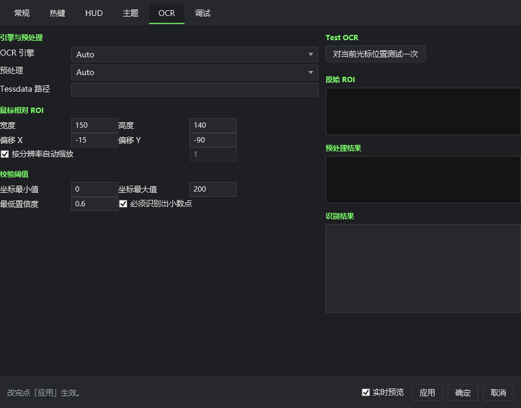
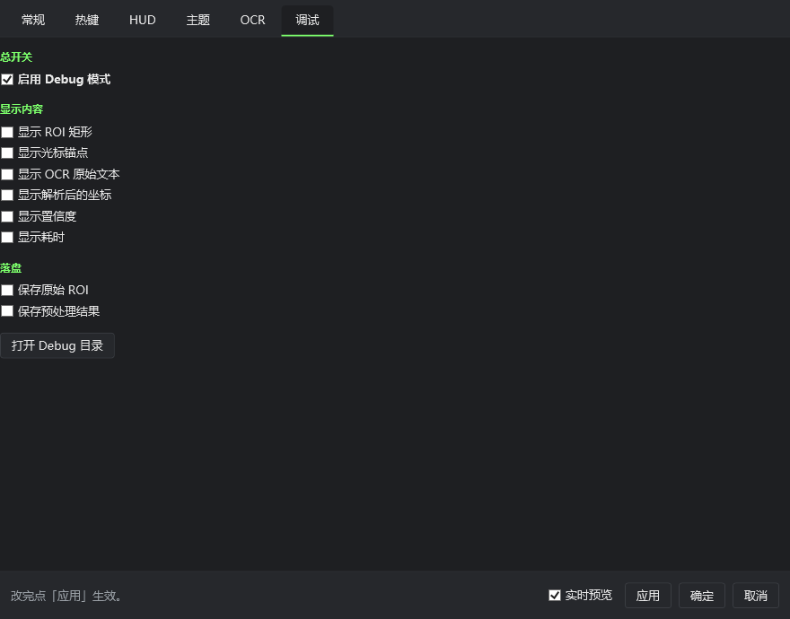

# MortarHUD 基线审查（2026-09-17）

## 范围与基线

- 初始提交：`45418fe`，`main`，140 个文件、18,477 行文本新增。沿用已有 `.gitignore`，源码、文档、OCR 模型和实机样本已入库；`dist/`、`bin/`、`obj/` 不入库，现有发布目录保留。未配置远端、未推送。
- 本轮为项目接手审查。未修改应用源码、用户设置、原始截图或现有发布目录；审查文档与截图为基线之后的新文件，未提交。
- 已执行 Release 构建：0 警告、0 错误；测试：170 Core + 20 OCR = 190 项通过。
- 用新构建程序的 `--screenshot` 生成并查看六页离屏截图。没有模拟输入、注入游戏或读写游戏内存。

## 项目理解

这是一个离线 Windows WPF 外置 HUD。输入层观察热键，采集层读取光标并截取小块 ROI；OpenCV 做预处理，Tesseract 识别，Parser 提取严格格式的 x/y，Validator 校验，Session 保存炮位和目标，Calculator 算距离和方位角，Overlay 显示结果。

Core / Capture / Platform.Windows / App 的分层可以保留，无须先推倒重写。当前主要风险集中在 App 的异步采集调度、输入事件解码、OCR 置信度策略和发布配置。计算层和失败不覆盖坐标等状态语义已有测试基础。

## P0：已确认的问题

### 1. M 的按下、松开都会启动校准

`src/MortarHUD.Platform.Windows/Hotkeys/GlobalHotkeyManager.cs:385` 的 `HandleRawKeyboard` 只读 VKey，不检查 RAWKEYBOARD.Flags 的按键释放标志，也没有过滤长按重复事件。

`App.xaml.cs:715` 每次收到校准事件都会取消旧任务并重新等待 350ms。因此松开 M 会重置等待，长按重复输入也可能延后采集。日志 `2026-09-17.log` 的 01:24:29.015 / 01:24:29.061 可见成对触发，第二次随即取消第一次。这能解释部分迟钝，不能据此认定所有失败都来自这里。

修复方向：按下一次只触发一次，松开仅清理按键状态；匹配修饰键；对按下/松开、长按、再次按下补事件解码测试，不用模拟系统输入。

### 2. OCR 测试配置与实际运行配置不同，已经复现

`tests/MortarHUD.Ocr.Tests/OcrPipelineTests.cs:28` 把 MinimumConfidence 设为 0；实际默认配置和当前用户配置都是 0.6。

`CoordinateRecognizer.RunOneAsync` 在聚合前使用原始 OCR 置信度调用 Validator。之后虽计算了“综合置信度”，却没有按该值执行最终门槛校验，和注释描述不一致。

用相同引擎、相同 A/C 流水线和相同仓库实机样本做隔离复现：

| 样本 | 门槛 0（现有端到端测试） | 门槛 0.6（实际配置） |
| --- | --- | --- |
| 001 | 正确 | 正确，但 A 的正确结果被 LOW_CONFIDENCE 淘汰 |
| 002 | 正确 | 正确 |
| 003 | 正确：107.66 / 114.54 | 失败：LOW_CONFIDENCE / Y_NOT_FOUND |

003 的 A 读出 `y114.54 / x107.66`，原始置信度为 0；C 的 Y 格式不合法。测试全绿并不能证明默认配置能通过现有三张样本。

复现程序在忽略目录 `_analysis/ocr-probe/`，可执行：

```powershell
& 'C:/dotnet10/dotnet.exe' run --project _analysis/ocr-probe/OcrProbe.csproj -c Release
```

修复方向：明确原始 OCR 置信度、格式/范围校验、流水线一致性及最终接受门槛各自职责。用真实默认配置做回归，并补低置信度正确/错误结果、冲突结果测试。不能直接把用户门槛改为 0，也不能用旧目标代替本次识别来制造成功。

### 3. 自动校准的取消没有覆盖采集和提交

`App.xaml.cs:728,743` 调用 `CaptureOnceAsync` 时没有传 CancellationToken；`CaptureOnceAsync:592` 也没有把令牌传给采集服务，成功后直接写 Session。

所以当前取消只控制等待，不能保证已在 OCR 中的旧任务不会晚到并更新炮位。`CancelPendingAutoCalibrate` 的调用点也只在手动采集和下一轮自动校准，不包含文档所称的“任何其它操作”，鼠标移动本身不会取消。

修复方向：把识别和提交分开；令牌/操作序号贯穿全链路，提交前再次确认任务仍有效；为迟到结果、移动光标、关闭地图及后续操作建立明确失效条件。游戏关图与开图都用 M，不能仅靠固定延迟证明当前画面是炮位。

### 4. 多轮手动重试可以交错

采集服务的 SemaphoreSlim 只保护单次采集，不保护 App 的整个三次重试周期。第二个热键可能在第一轮的 120ms 等待期间进入；旧轮次随后又读取新的光标位置。BUSY 还会被外层当作失败继续重试。

修复方向：以一次用户意图管理整轮操作，明确新请求替代旧请求；BUSY 不显示成识别失败，也不创建无效重试。当前日志已有 4 条 BUSY 转储，但未用真实游戏复现所有竞态。

## OCR 数据的边界

本机 `%AppData%/MortarHUD/Debug/` 当前有 273 份结果 JSON、没有原始 ROI 或预处理 PNG。其中 161 份结果标记成功，112 份失败，包括格式缺失、LOW_CONFIDENCE、12 次 PIPELINE_DISAGREEMENT 和 4 次 BUSY。

这不是准确率统计：没有完整真值，含开关地图、桌面操作和重复尝试。日志可以证明错误类型和调度行为，无法证明阈值切断笔画是剩余间歇失败的根因。用户已排除遮挡，不再把遮挡当作默认解释；算法调优仍需失败图片。建议后续提供一次操作即可收集原图、各流水线图和结果的有限量诊断入口。

## 界面审查

截图来自本轮 Release 构建，以当前用户设置离屏渲染为 880×690。只验证页面初始布局；没有执行设置应用、主题删除等操作，没有验证真实窗口焦点、键盘导航、滚动后的内容、高 DPI 或屏幕阅读器。

1. **常规：基础项目可读，空间分配不佳。** 左侧贴边，大面积空白，缺少简短的使用流程提示。
2. **热键：核心功能齐全，分组欠清楚。** 自动校准开关和恢复默认并排，键位输入密集；应把自动校准的开关、地图键和等待时间归为一组。
3. **HUD：信息过载。** 字体、间距、七种颜色、描边阴影等平铺，主要操作被长表单淹没；实时预览有价值，应保留。先展示预设、大小和位置，其余进入高级选项。
4. **主题：操作过多且缺乏主次。** 七个按钮并列，保存、覆盖、删除和选择主题的视觉权重接近；离屏初始状态下“主题内容”区域空白，是否正常加载后更新需另验。
5. **OCR：开发参数直接面向普通玩家。** Engine、Pipeline、Tessdata、ROI、门槛一起出现；测试区未执行时只有空框，应有明确空状态和下一步说明。
6. **调试：初始开关状态容易漏存证据。** 当前 Debug 已开但两项图片保存未开，与只有 JSON 的本机数据吻合；建议提供收集诊断的一体化入口。

源码已解释一个共同布局缺陷：`SettingsWindow.xaml:46` 设置 `TabControl.Padding=12`，但 `SettingsTheme.xaml:87` 的自定义模板没有绑定 Padding，导致页面内容贴边。截图中灰色辅助文案的对比度、较小的复选框点击区域也需改进；完整可访问性结论需要交互测试。

建议界面结构：日常使用、外观、诊断三组；默认页面先告诉玩家如何锁炮位和记录目标，再提供必要设置。主题预设和 HUD 预览合并展示；高级字体特效、引擎路径、算法选择收起。保留可用能力，先降低界面复杂度。








## 发布体积与压缩方向

当前 `dist/MortarHUD/` 实测 287 个文件、251.73 MiB。这是现有发布产物测量，不是重新发布后的体积。

| 文件 | MiB |
| --- | ---: |
| OpenCvSharpExtern.dll | 58.88 |
| opencv_videoio_ffmpeg4100_64.dll | 25.17 |
| System.Private.CoreLib.dll | 15.29 |
| PresentationFramework.dll | 15.08 |
| System.Windows.Forms.dll | 13.08 |
| PresentationCore.dll | 7.94 |
| eng.traineddata | 3.92 |

体积大头是通用 OpenCV 和自带 .NET/WPF 运行时。删除主题编辑、颜色设置等少量业务代码，主要减少复杂度，对体积收益有限。删除模板资源也不是主要收益点。

推荐顺序：

1. 在独立输出目录比较 .NET 原生单文件压缩；当前 `publish.cmd:41` 显式为 `EnableCompressionInSingleFile=false`。测量包体、启动耗时以及解压缓存占用，不能把分发体积下降等同于实际磁盘总占用下降。
2. 缩减原生依赖：评估仅含必要模块的 OpenCV 构建/可靠依赖包，或逐步替换本项目用到的少量图像算子。FFmpeg 对当前静态截屏链路没有业务用途，但不能从现有 deps.json 引用的产物中直接删文件，应在依赖/发布层正确处理。
3. 可选提供依赖运行时的小包，但用户需预先安装 .NET 10 Desktop Runtime；现有“无需额外安装”的便携版仍需自包含。
4. 第三方压缩壳放在后面评估：必须验证 .NET 宿主、WPF/OpenCV/Tesseract 原生库加载、冷启动和安全软件兼容性；不先承诺节省比例。WPF 裁剪/AOT 也不能当作即开即用的瘦身开关。

发布脚本还有已确认的环境缺陷：只要 PATH 能找到 dotnet 就使用它，而本机文档明确指出 PATH 默认是 .NET 6。应优先选择指定 SDK。脚本文案、AGENTS 对 single-file/folder 的描述也存在漂移，应以新产物验证后统一。未执行现有发布脚本覆盖 dist。

## 图标

EXE 项目没有配置 ApplicationIcon；托盘已有运行时画出的简易准星，因此准确说是缺少统一的应用图标资源。

建议沿用准星/定位符号语义，采用简洁单色线条和一个强调点，避免渐变、拟物炮弹和复杂插画。先检查 16/24/32px 的可辨认性，再提供 48/64/128/256px ICO，并统一 EXE、窗口、托盘。当前没有生成或替换图标。

## 后续实施顺序与验收

1. **输入与采集正确性**：修复 M 释放/重复触发，完成取消到提交的闭环，防止旧操作覆盖新状态。用不发送系统输入的测试验证事件序列及异步竞态。
2. **OCR 正确性**：统一测试与默认配置；真实样本回归；补齐失败图片和真值。不得靠猜小数点、放宽到无条件接受或回填旧目标“提高成功率”。
3. **GUI 与图标**：简化日常入口、合并外观配置、收起高级项，验证六页布局和真实交互，并加入统一小尺寸图标。
4. **瘦身**：分别记录下载包、展开目录、首次启动缓存、启动耗时，依赖调整后验证程序和真实识别。保留可回退的独立产物。

本轮没有执行游戏内长时间测试、DPI/多显示器/独占全屏测试，也没有声称 OCR 间歇失败已经全部定位或修复。特别注意：现有 `--selftest` 实现会实际调用屏幕采集，且识别失败也可能退出 0，不能把它当成完全离线、不接触桌面或识别准确率的证明。
